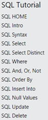

# SQL

På https://www.w3schools.com/sql/default.asp findes en rigtig god 
SQL-vejledning.   
Læs den.  
Du skal forstå hvad kommandoerne gør men du behøver ikke at lære kommandoer og deres syntaks udenad fordi vi skal bruge en Python bibliotek, som skriver SQL koden for os.

Du skal få en overblik over SQL. Detaljer er ikke så vigtig nu.   
Brug derfor 
nu højst 90 minutter for at læse om SQL på w3schools.   
Hvis du vil fordybe 
dig i SQL kan du gerne vende tilbage senere og læse det hele SQL-tutorial.   
Det er dog ikke nødvendig for S2-modulet.

Læs de første 12 sider. Altså dem du kan se i den følgende screenshot:

Læs også https://www.w3schools.com/sql/sql_create_table.asp

## Vigtige Begreber

### CRUD

CRUD står for **C**reate (betyder her ”tilføj”), **R**ead, **U**pdate, 
**D**elete, som er de basale funktioner man bruger i en database.   
I SQL 
hedder de tilsvarende kommandoer Insert Into, Select, Update, Delete.

### Primary Key

Primærnøgler identificerer entydigt hver enkelt post i en tabel.   
Primærnøgler skal indeholde UNIQUE-værdier og kan ikke indeholde 
NULL-værdier.   
En tabel kan kun have én primær nøgle, og i tabellen kan den 
bestå af en enkelt eller flere kolonner (felter).

### Foreign Key

En fremmednøgle skaber forbindelser mellem to tabeller. Den bruges også til at forhindre handlinger, der kan ødelægge forbindelser mellem tabeller. En fremmednøgle er et felt (eller en samling af felter) i en tabel, der henviser til primærnøglen i en anden tabel.

-------

Åbn nu den næste fil i samme mappe.
